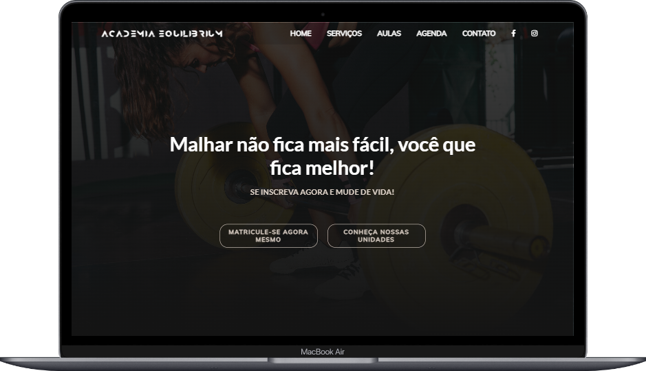

<h1 align="center">
  Academia Equilibrium
</h1>

  <a href="#-tecnologias">Tecnologias</a>&nbsp;&nbsp;&nbsp;|&nbsp;&nbsp;&nbsp;
  <a href="#-projeto">Projeto</a>&nbsp;&nbsp;&nbsp;|&nbsp;&nbsp;&nbsp;
  <a href="#-layout">Layout</a>&nbsp;&nbsp;&nbsp;|&nbsp;&nbsp;&nbsp;
  <a href="#-licença">Licença</a>

## 🎨 Layout

Aqui você pode conferir o layout em suas respectivas versões.

<h2 align="left">
  Versão Web
</h2>
 

  

<h2 align="left">
  Versão Mobile
</h2>
 

  

## 🚀 Tecnologias

Esse projeto foi desenvolvido com as seguintes tecnologias:

- HTML
- CSS

## 💻 Projeto

Academia Equilibrium é um projeto de landing page visando exercitar meus aprendizados sobre HTML,CSS e principalmente utilizando o FLEXBOX 🏋️‍♂️.

## 📝 Licença

Esse projeto está sob a licença MIT. Veja o arquivo [LICENSE](LICENSE) para mais detalhes.

---

Feito com ♥ by Gabriel Gonçalves 🖖